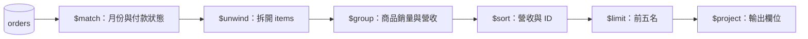

# 聚合管道 Aggregation

**前置條件：** [匯入共用資料](lab.md)。本章產出 2026 年 1 月已付款訂單的商品營收排行榜，金額單位為新台幣分。

---

## 什麼是聚合管道（Aggregation Pipeline）？

在 MongoDB 中，若只是要「找文件」或「篩選特定資料」，使用 `db.collection.find()` 就足夠了；但若要回答以下商業問題，`find()` 便力不從心：
- *「本月份各類別商品的累積營業額是多少？」*
- *「訂單成立時，如何同時關聯出購買者的會員等級與商品目前的即時庫存？」*
- *「消費金額排名前五名的 VIP 顧客是誰？平均每單消費多少？」*

**「聚合管道 (Aggregation Pipeline)」** 就是 MongoDB 專門為**大規模數據統計、分組計算與多表關聯**所設計的高效能處理引擎。

---

### 資料管線心智模型（Pipeline & Stages）

理解聚合管道最直觀的方式，就像 Linux 中的 Pipe 管線操作（`cat file | grep ... | sort`）或是資料串接處理流水線：

1. **資料輸入**：原始集合（Collection）的文件作為管線的起點。
2. **多個處理階段（Stages）**：管線由多個循序執行的 Stage 組成，每個 Stage 只專注做好一件事（例如：過濾、展開陣列、分組統計、排序）。
3. **成果輸出**：前一個 Stage 處理完的結果，直接作為下一個 Stage 的輸入，最終產出精準的統計報表或塑形結果。

```
[原始 Collection 資料]
       │
       ▼
 ┌───────────┐
 │  $match   │ ➔ Stage 1：過濾資料（篩選本月已付款訂單，優先走索引）
 └─────┬─────┘
       ▼
 ┌───────────┐
 │  $unwind  │ ➔ Stage 2：展開陣列（將訂單內的 items 陣列打散為單筆商品項目）
 └─────┬─────┘
       ▼
 ┌───────────┐
 │  $group   │ ➔ Stage 3：分組計算（依商品分組，計算各商品總銷量與總金額）
 └─────┬─────┘
       ▼
 ┌───────────┐
 │   $sort   │ ➔ Stage 4：排序整理（依營業額由高至低遞減排序）
 └─────┬─────┘
       ▼
[最終商業報表結果]
```

---

### 核心用途與優勢：為什麼不用 `find()`？

| 傳統 `find()` 配合程式碼計算（反模式） | MongoDB 聚合管道（正確做法） |
| :--- | :--- |
| 需將 10 萬筆原始訂單透過網路載入後端伺服器記憶體 | 在資料庫伺服器內部直接計算，**只回傳最終統計的幾行摘要** |
| 後端伺服器 CPU 飆高、耗盡頻寬，容易引發 OOM 崩潰 | 充分享受資料庫索引與記憶體/磁碟快取優化 |
| 跨集合關聯需在應用層寫大量 for 迴圈與多重非同步查詢 | 透過 `$lookup` 階段由資料庫底層高效完成 Join |

---

### SQL 語法心智對照表

若您具備關聯式資料庫（SQL）背景，以下對照能幫助您瞬間掌握聚合階段的作用：

| 聚合階段 (Stage) | 對應 SQL 語法 | 核心作用 |
| :--- | :--- | :--- |
| **`$match`** | `WHERE` / `HAVING` | 過濾文件，只保留符合條件的記錄 |
| **`$group`** | `GROUP BY` + `SUM()` / `AVG()` | 依指定欄位分組，並計算總和、平均、最大最小值等 |
| **`$project`** / **`$addFields`** | `SELECT col1, (col2 * col3) AS total` | 挑選輸出欄位、重新命名或計算衍生欄位 |
| **`$sort`** | `ORDER BY` | 排序（1 為遞增，-1 為遞減） |
| **`$limit`** / **`$skip`** | `LIMIT` / `OFFSET` | 分頁控制與擷取前 N 名結果 |
| **`$lookup`** | `LEFT OUTER JOIN` | 跨 Collection 關聯查詢 |
| **`$unwind`** | *(SQL 無原生對應)* | 將文件內的陣列展開為多筆獨立文件 |

---

## 1. Pipeline 的資料流




每個 stage 接收前一階段的結果，欄位及筆數可能已改變。以下表格為各階段的閱讀提示；實際可執行程式在下一節。

| Stage | 用途 | 常見陷阱 |
| --- | --- | --- |
| `$match` | 篩選 | 原始欄位條件通常可放前面利用索引；計算後的欄位不能任意前移 |
| `$unwind` | 一個陣列元素變成一筆 | 預設會排除空陣列、null 或不存在欄位的文件；需要保留時設定 preserveNullAndEmptyArrays |
| `$group` | 依 _id 分組 | `$sum: 1` 計算輸入列數，不一定等於訂單數 |
| `$sort` | 排序 | 加入唯一次排序鍵，避免同分結果順序不穩定 |
| `$project` | 欄位投影與計算 | `"$field"` 代表引用欄位值；未加 `$` 的普通字串則視為純字串常數（Literal） |
| `$lookup` | 跨集合關聯 | 結果為陣列，雙方關聯鍵的 BSON 型別須一致 |

---

### 深入解析：什麼是 `$unwind`？（陣列扁平化）

**「Unwind」** 的字面意思是「解開、攤平（例如把捲起來的包裹或毛線解開）」。在 MongoDB 中，它的作用是**「將文檔中的陣列欄位打散，使陣列中的每個元素都獨立分裂成一筆單獨的文檔」**。

#### 1. 展開前 vs 展開後的資料形態變化

假設有一筆訂單，裡面包含購買了兩項商品的陣列：

```json
// 【輸入】：原始 1 筆訂單文件
{
  "_id": "order_101",
  "customer": "Alice",
  "items": [
    { "name": "鍵盤", "qty": 1, "price": 3000 },
    { "name": "滑鼠", "qty": 2, "price": 1000 }
  ]
}
```

當管道執行了 `{$unwind: "$items"}` 之後，這 1 筆訂單會**分裂成 2 筆獨立文件**，原有的外部欄位（`_id`, `customer`）會被完整複製：

```json
// 【輸出】：展開為 2 筆獨立文件（items 不再是陣列，而是單一物件）
{
  "_id": "order_101",
  "customer": "Alice",
  "items": { "name": "鍵盤", "qty": 1, "price": 3000 }
}
{
  "_id": "order_101",
  "customer": "Alice",
  "items": { "name": "滑鼠", "qty": 2, "price": 1000 }
}
```

#### 2. 為什麼一定要使用 `$unwind`？
MongoDB 的 `$group` 階段**無法直接跨文件對「陣列內層的多個元素」進行分組加總**。  
例如：若要統計全店「各商品的總銷售數量與營業額」，資料庫必須先透過 `$unwind` 將每張訂單中的商品打平成獨立的數據列，下一個 Stage 的 `$group: { _id: "$items.name", totalQty: { $sum: "$items.qty" } }` 才能精準對「鍵盤」與「滑鼠」分別進行加總！

#### 3. 🚨 重大陷阱：消失的空陣列（與解法）
- **預設行為**：若某張訂單的 `items: []` 是空陣列，或欄位為 `null`、不存在，`$unwind` 預設會**直接將該筆訂單丟棄（從輸出中完全蒸發）**！
- **正確解法（保留無項目的文件）**：改用完整的物件語法，開啟 `preserveNullAndEmptyArrays: true`：
  ```javascript
  {
    $unwind: {
      path: "$items",
      preserveNullAndEmptyArrays: true // ⭐️ 空陣列或 null 仍保留原始文檔不丟棄
    }
  }
  ```

---


## 2. 月度商品排行榜：完整可執行範例

程式位於 `examples/mongosh/aggregation.js`，執行命令見[驗證流程](lab.md)。

```javascript
--8<-- "examples/mongosh/aggregation.js"
```

UTC 起始時間包含、結束時間不包含，避免跨月重複計入。若業務月份依台北時間，應先把台北月初及下月月初換算成 UTC；不要只改畫面上的日期文字。

| productId 尾碼 | 商品 | 銷量 | totalRevenue |
| --- | --- | --- | --- |
| 001 | 無線降噪耳機 | 3 | 1497000 |
| 003 | 4K 27吋螢幕 | 1 | 990000 |
| 002 | 人體工學鍵盤 | 1 | 320000 |

取消訂單和 2 月訂單不計入。只有三種商品，limit=5 不會憑空補足五筆。程式依商品 ID 統計；若要顯示目前商品名稱，可在分組後 lookup products。訂單明細名稱和 unitPrice 則是下單當時快照，不應隨商品改價而重算歷史營收。

## 3. 關聯與其他累加器

```javascript
db.orders.aggregate([
  {$match: {_id: ObjectId("300000000000000000000001")}},
  {$lookup: {from: "users", localField: "userId", foreignField: "_id", as: "userInfo"}},
  {$project: {_id: 0, status: 1, customerNames: "$userInfo.name"}}
])
// {status: "PAID", customerNames: ["Alice"]}

db.products.aggregate([
  {$group: {_id: "$category", averagePrice: {$avg: "$price"}, productNames: {$addToSet: "$name"}, count: {$sum: 1}}},
  {$sort: {_id: 1}}
])
```

`$addToSet` 的結果順序沒有保證。`$first` 要表達「第一筆」時，必須先定義順序；不要假設自然順序等於時間順序。

## 4. 效能與練習

只有不改變語意時，才能提前 match 或 limit。排行榜若把 limit 移到 group 前面，會只統計部分訂單。用 Compass 逐個 stage 預覽，並透過 explain 檢查原始集合掃描；group 後的營收排序通常不能靠原始集合索引完成。

**練習：** 把 2 月的訂單錯誤納入，為何螢幕會成為第一名？如何避免？

??? success "解答"
    2 月訂單包含十台螢幕，會多出 9900000 分營收。月份條件必須同時包含 gte 月初與 lt 下月月初；腳本的預期結果斷言能抓到這類錯誤。

參考：[Pipeline optimization](https://www.mongodb.com/docs/manual/core/aggregation-pipeline-optimization/)。
