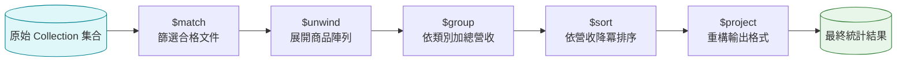

# Level 3：聚合管道 (Aggregation Framework)

如果說 CRUD 是資料庫的基礎對話，那麼 **聚合管道 (Aggregation Framework)** 就是 MongoDB 的「分析瑞士刀與超強引擎」。它能取代 SQL 中複雜的 `GROUP BY`、`JOIN`、子查詢以及各種資料轉換函數。

---

## 1. 聚合管道的核心心智模型

聚合的核心是 **Pipeline（流水線）**。前一個階段（Stage）的輸出，會作為下一個階段的輸入。



基本呼叫語法：
```javascript
db.collection.aggregate([
  { $stage1: { ... } },
  { $stage2: { ... } },
  { $stage3: { ... } }
]);
```

---

## 2. 常用 Stage 詳解

### A. `$match`：初期快速過濾
在管道的最開端使用 `$match` 可以大幅減少後續階段需要處理的資料筆數，且在開頭能有效利用索引！

```javascript
// 只分析 2026 年已完成付款的訂單
{ $match: { status: "completed", orderDate: { $gte: ISODate("2026-01-01") } } }
```

### B. `$group`：分組與統計
依據指定的 `_id` 欄位進行分組，並搭配累加器（Accumulator）進行運算。

```javascript
{
  $group: {
    _id: "$category",                 // 分組鍵 (必須以 $ 符號引用欄位)
    totalRevenue: { $sum: "$amount" }, // 累加總額
    avgPrice: { $avg: "$price" },     // 計算平均
    itemCount: { $sum: 1 },           // 計算數量 (count)
    productNames: { $addToSet: "$name" } // 收集不重複的商品名清單
  }
}
```

### C. `$project`：投影與欄位重構
挑選、重命名欄位，甚至計算新值。

```javascript
{
  $project: {
    _id: 0,
    categoryName: "$_id",
    totalRevenue: 1,
    roundedAvgPrice: { $round: ["$avgPrice", 2] } // 四捨五入到小數點第二位
  }
}
```

### D. `$unwind`：陣列平鋪展開
將包含陣列的單筆文件，按陣列元素拆分為多筆文件。這在統計陣列內元素時是必備操作。

```javascript
// 原始文件：{ orderId: 101, items: ["耳機", "滑鼠"] }
// 經過 $unwind: "$items"
// 拆為兩筆：
// 1. { orderId: 101, items: "耳機" }
// 2. { orderId: 101, items: "滑鼠" }
{ $unwind: "$items" }
```

### E. `$lookup`：跨集合關聯 (相當於 SQL LEFT JOIN)

```javascript
{
  $lookup: {
    from: "users",            // 要關聯的外部集合名稱
    localField: "userId",     // 當前集合的關聯欄位
    foreignField: "_id",      // 外部集合的目標欄位
    as: "userInfo"            // 關聯結果存放的欄位名稱 (為陣列)
  }
}
```

---

## 3. 綜合實戰範例：月度熱門商品銷售排行榜

假設有訂單集合 `orders`，我們要產出一份**「已付款訂單中，銷售總金額最高的前 5 名商品」**：

```javascript
db.orders.aggregate([
  // 階段 1：篩選已付款訂單
  {
    $match: {
      status: "PAID"
    }
  },

  // 階段 2：將訂單明細陣列 items 展開
  // items 結構範例：[{ productId: "P1", name: "機械鍵盤", qty: 2, unitPrice: 3000 }]
  {
    $unwind: "$items"
  },

  // 階段 3：依商品 ID 分組，計算總銷量與總銷售金額
  {
    $group: {
      _id: "$items.productId",
      productName: { $first: "$items.name" },
      totalQuantitySold: { $sum: "$items.qty" },
      totalRevenue: {
        $sum: { $multiply: ["$items.qty", "$items.unitPrice"] }
      }
    }
  },

  // 階段 4：依營收由高到低排序
  {
    $sort: { totalRevenue: -1 }
  },

  // 階段 5：限制只取前 5 名
  {
    $limit: 5
  },

  // 階段 6：美化輸出格式
  {
    $project: {
      _id: 0,
      productId: "$_id",
      productName: 1,
      totalQuantitySold: 1,
      totalRevenue: 1
    }
  }
]);
```

!!! tip "效能心法"
    1. **Early Filtering**：盡量把 `$match` 與 `$limit` 放到管道最前方，讓後續處理的資料量最小化。
    2. **善用 Compass 視覺化管道**：MongoDB Compass 提供了 Stage 預覽功能，能逐步檢驗每一步轉換的資料格式，除錯極為直覺！
