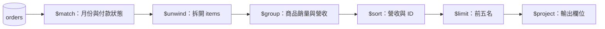

# Level 3：聚合管道 Aggregation

**前置條件：** [匯入共用資料](lab.md)。本章產出 2026 年 1 月已付款訂單的商品營收排行榜，金額單位為新台幣分。

## 1. Pipeline 的資料流



每個 stage 接收前一階段的結果，欄位及筆數可能已改變。以下表格為各階段的閱讀提示；實際可執行程式在下一節。

| Stage | 用途 | 常見陷阱 |
| --- | --- | --- |
| `$match` | 篩選 | 原始欄位條件通常可放前面利用索引；計算後的欄位不能任意前移 |
| `$unwind` | 一個陣列元素變成一筆 | 預設會排除空陣列、null 或不存在欄位的文件；需要保留時設定 preserveNullAndEmptyArrays |
| `$group` | 依 _id 分組 | `$sum: 1` 計算輸入列數，不一定等於訂單數 |
| `$sort` | 排序 | 加入唯一次排序鍵，避免同分結果順序不穩定 |
| `$project` | 欄位投影與計算 | `"$field"` 是欄位引用，普通字串是字面值 |
| `$lookup` | 跨集合關聯 | 結果為陣列，雙方關聯鍵的 BSON 型別須一致 |

## 2. 月度商品排行榜：完整可執行範例

程式位於 `examples/mongosh/aggregation.js`，執行命令見[驗證流程](lab.md)。

```javascript
--8<-- "examples/mongosh/aggregation.js"
```

UTC 起始時間包含、結束時間不包含，避免跨月重複計入。若業務月份依台北時間，應先把台北月初及下月月初換算成 UTC；不要只改畫面上的日期文字。

| productId 尾碼 | 商品 | 銷量 | totalRevenue |
| --- | --- | --- | --- |
| 001 | 無線降噪耳機 | 3 | 1497000 |
| 003 | 4K 27吋螢幕 | 1 | 990000 |
| 002 | 人體工學鍵盤 | 1 | 320000 |

取消訂單和 2 月訂單不計入。只有三種商品，limit=5 不會憑空補足五筆。程式依商品 ID 統計；若要顯示目前商品名稱，可在分組後 lookup products。訂單明細名稱和 unitPrice 則是下單當時快照，不應隨商品改價而重算歷史營收。

## 3. 關聯與其他累加器

```javascript
db.orders.aggregate([
  {$match: {_id: ObjectId("300000000000000000000001")}},
  {$lookup: {from: "users", localField: "userId", foreignField: "_id", as: "userInfo"}},
  {$project: {_id: 0, status: 1, customerNames: "$userInfo.name"}}
])
// {status: "PAID", customerNames: ["Alice"]}

db.products.aggregate([
  {$group: {_id: "$category", averagePrice: {$avg: "$price"}, productNames: {$addToSet: "$name"}, count: {$sum: 1}}},
  {$sort: {_id: 1}}
])
```

`$addToSet` 的結果順序沒有保證。`$first` 要表達「第一筆」時，必須先定義順序；不要假設自然順序等於時間順序。

## 4. 效能與練習

只有不改變語意時，才能提前 match 或 limit。排行榜若把 limit 移到 group 前面，會只統計部分訂單。用 Compass 逐個 stage 預覽，並透過 explain 檢查原始集合掃描；group 後的營收排序通常不能靠原始集合索引完成。

**練習：** 把 2 月的訂單錯誤納入，為何螢幕會成為第一名？如何避免？

??? success "解答"
    2 月訂單包含十台螢幕，會多出 9900000 分營收。月份條件必須同時包含 gte 月初與 lt 下月月初；腳本的預期結果斷言能抓到這類錯誤。

參考：[Pipeline optimization](https://www.mongodb.com/docs/manual/core/aggregation-pipeline-optimization/)。
