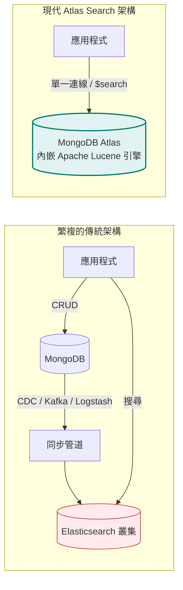
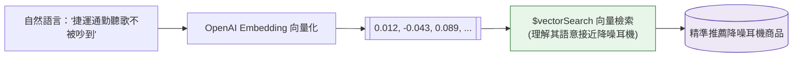

# 進階專題：MongoDB Atlas Search (全文檢索與向量搜尋)

在過去，若應用程式需要強大的搜尋功能（例如打字自動補全、錯字容忍、繁簡中文分詞、相關度權重排序），架構師往往必須在 MongoDB 旁邊額外架設一座 **Elasticsearch** 叢集，並透過 CDC 工具（如 Debezium、Kafka）同步資料。

**MongoDB Atlas Search** 徹底顛覆了這種複雜架構：它直接將業界標準的 **Apache Lucene 搜尋引擎**深植於 MongoDB 之中，無需維運額外叢集，也無資料同步延遲，且直接透過現有的聚合管道（`$search`）即可查詢！



---

## 1. 傳統 `$text` 索引 vs Atlas Search

| 特性比較 | 傳統 MongoDB `$text` 索引 | 現代 Atlas Search (`$search`) |
| :--- | :--- | :--- |
| **底層技術** | MongoDB 內建簡單反向索引 | **Apache Lucene 完整搜尋引擎** |
| **中文分詞支援** | 弱（無空格分詞困難，需設為 `none`） | **強大（內建 `lucene.cjk`、`lucene.smartcn`、自訂 N-gram）** |
| **錯字容錯 (Fuzzy Search)** | ❌ 不支援 |  支援（設定 `fuzzy: { maxEdits: 2 }`） |
| **精確 Keyword 匹配** | 依賴一般 B-Tree 索引 |  **原生 `token` 索引與多重分析器支援** |
| **自動補齊 (Autocomplete)** | ❌ 困難且效能差 |  原生專用分詞器，體驗極佳 |
| **向量檢索 (Vector Search)** | ❌ 不支援 |  **支援 AI 向量搜尋與 RAG 架構** |
| **計分調權 (Scoring / Boost)** | 陽春 |  支援強大的 BM25 演算法與動態評分權重 |

---

## 2. 🀄 中文語系全文檢索核心實踐

英文單字以空格自然分開，但中文語句「**無線藍牙降噪耳機**」沒有空格，若使用預設的 `lucene.standard` 分詞器，常會將中文拆成單個孤立字元，導致搜尋不精準或召回率（Recall）過低。

### A. Atlas Search 支援的中文分析器 (Analyzers)

1. **`lucene.cjk`（中日韓雙字切詞，最推薦繁體中文使用）**：
   - 採用 **Bi-gram (2-gram)** 雙字滑動分詞。
   - 「無線降噪」會切成：`["無線", "線降", "降噪"]`。
   - **優點**：不依賴簡體詞典，對繁體中文、人名、專有名詞的搜尋覆蓋率極高！
2. **`lucene.smartcn`（Smart Chinese 智慧分析器）**：
   - 內建大型中文詞典與隱馬爾可夫模型（HMM），偏向簡體中文分詞。
3. **自訂 N-Gram 分析器（任意子字串命中）**：
   - 可設定 `minGram: 1, maxGram: 2`，無論使用者搜尋單字或雙字關鍵字都能 100% 命中。

### B. 支援中文與 Keyword 的搜尋索引 JSON 配置

以下是在 Atlas 建立 Search Index 的黃金範例配置，同一個欄位同時支援**中文全文檢索**、**即時自動補全**與**不分詞精確 Keyword 比對**：

```json
{
  "mappings": {
    "dynamic": false,
    "fields": {
      "name": [
        {
          "type": "string",
          "analyzer": "lucene.cjk"
        },
        {
          "type": "autocomplete",
          "analyzer": "lucene.cjk"
        }
      ],
      "description": {
        "type": "string",
        "analyzer": "lucene.cjk"
      },
      "sku": {
        "type": "token"
      },
      "tags": {
        "type": "string",
        "analyzer": "lucene.keyword"
      }
    }
  }
}
```

- **`type: "token"` 或 `analyzer: "lucene.keyword"`**：
  整串字串視為單一整體（不拆詞、不轉小寫）。適用於 SKU 商品編號、訂單號碼、狀態碼或專屬標籤。

---

## 3. 🔍 中文關鍵字與 Keyword 搜尋實戰

### A. 中文全文語意檢索 (`text` 運算符)
使用者輸入「降噪耳機」，Lucene 會利用 CJK 分析器拆解匹配，並按照相關度（BM25 Score）由高至低排列：

```javascript
db.products.aggregate([
  {
    $search: {
      index: "default",
      text: {
        query: "降噪耳機",
        path: ["name", "description"]
      }
    }
  },
  {
    $project: {
      name: 1,
      price: 1,
      score: { $meta: "searchScore" }
    }
  }
]);
```

### B. 中文連續片語精確比對 (`phrase` 運算符)
要求關鍵字必須「相連且順序一致」（例如必須剛好包含「人體工學」，不可被其他字中斷）：

```javascript
db.products.aggregate([
  {
    $search: {
      index: "default",
      phrase: {
        query: "人體工學",
        path: "description",
        slop: 0 // 允許中間插入的單詞數，0 代表嚴格相連
      }
    }
  }
]);
```

### C. 精確 Keyword 匹配 (`equals` 運算符)
針對定義為 `type: "token"` 的 `sku` 或 `tag` 欄位進行嚴格匹配，相當於全文引擎裡的精準查詢：

```javascript
db.products.aggregate([
  {
    $search: {
      index: "default",
      equals: {
        path: "sku",
        value: "TECH-2026-EAR-01"
      }
    }
  }
]);
```

### D. 中文搜尋框打字即時補全 (`autocomplete`)
輸入 `藍牙`，即時反饋包含「藍牙接收器」、「藍牙立體聲耳機」：

```javascript
db.products.aggregate([
  {
    $search: {
      index: "default",
      autocomplete: {
        query: "藍牙",
        path: "name",
        tokenOrder: "any"
      }
    }
  },
  { $limit: 5 },
  { $project: { name: 1 } }
]);
```

### E. 複合搜尋：中文關鍵字 + Keyword 標籤過濾 + 評分加權
業界電商搜尋最經典的「複合搜尋模型」：

```javascript
db.products.aggregate([
  {
    $search: {
      index: "default",
      compound: {
        must: [
          // 1. 必備條件：商品名稱必須匹配中文「機械鍵盤」
          {
            text: {
              query: "機械鍵盤",
              path: "name"
            }
          }
        ],
        should: [
          // 2. 加分條件：若含有「無線」標籤，大幅提高排序權重 (Boost x 3)
          {
            text: {
              query: "無線",
              path: "tags",
              score: { boost: { value: 3 } }
            }
          }
        ],
        filter: [
          // 3. 嚴格過濾：分類必須是「周邊配件」（不影響評分）
          {
            phrase: {
              query: "周邊配件",
              path: "category"
            }
          }
        ]
      }
    }
  },
  { $limit: 10 }
]);
```

---

## 4. 傳統 MongoDB 本地環境 `$text` 索引的中文技巧

如果您目前是在本地 Docker 環境運行標準 MongoDB（非 Atlas 雲端），傳統的 `$text` 索引因為缺乏內建中文詞典，預設會將中文長句當作單一英文字詞處理。

### 本地環境解法：
1. **建立索引時指定 `default_language: "none"`**：
   ```javascript
   // 關閉英文詞幹還原 (Stemming) 與停用詞過濾
   db.articles.createIndex(
     { title: "text", content: "text" },
     { default_language: "none" }
   );
   ```
2. **應用層分詞預處理（最推薦做法）**：
   在將資料存入 MongoDB 之前，在後端使用 **Jieba（結巴分詞）** 將字串預先切詞並以空白分隔或存成標籤陣列：
   - 原始內容：「這是一款超耐用的防水藍牙耳機」
   - 儲存內容：「這 是 一款 超 耐用 的 防水 藍牙 耳機」
   - 這樣即使使用本地 MongoDB 的 `$text` 也能享有完美的中文關鍵字查詢！

---

## 5. 現代 AI 核心：Atlas Vector Search (向量語義檢索)

當關鍵字無法精確表達使用者意圖時（例如使用者搜尋：「*想找適合在捷運上聽音樂不被干擾的裝備*」），字面完全沒有「耳機」或「降噪」二字，傳統關鍵字搜尋會掛零。此時需要 **向量語義搜尋**：



```javascript
db.products.aggregate([
  {
    $vectorSearch: {
      index: "vector_index",
      path: "embedding",
      queryVector: [0.0123, -0.0456, 0.0891, ...], // 自然語言轉換後的向量
      numCandidates: 100,
      limit: 5
    }
  },
  {
    $project: {
      name: 1,
      description: 1,
      similarity: { $meta: "vectorSearchScore" }
    }
  }
]);
```

---

## 6. 多語言中文搜尋呼叫範例

=== "Python (PyMongo)"
    ```python
    pipeline = [
        {
            "$search": {
                "index": "default",
                "text": {
                    "query": "人體工學 辦公椅",
                    "path": ["name", "description"]
                }
            }
        },
        {"$limit": 5}
    ]
    results = list(db.products.aggregate(pipeline))
    ```

=== ".NET (C#)"
    ```csharp
    var searchStage = new BsonDocument("$search", new BsonDocument
    {
        { "index", "default" },
        { "text", new BsonDocument
            {
                { "query", "人體工學 辦公椅" },
                { "path", new BsonArray { "name", "description" } }
            }
        }
    });

    var pipeline = new IPipelineStageDefinition[]
    {
        new SimplePipelineStageDefinition<Product, Product>(searchStage),
        PipelineStageDefinitionBuilder.Limit<Product>(5)
    };

    var results = await collection.Aggregate<Product>(pipeline).ToListAsync();
    ```

=== "Golang"
    ```go
    pipeline := mongo.Pipeline{
        {{"$search", bson.D{
            {"index", "default"},
            {"text", bson.D{
                {"query", "人體工學 辦公椅"},
                {"path", bson.A{"name", "description"}},
            }},
        }}},
        {{"$limit", 5}},
    }

    cursor, err := col.Aggregate(ctx, pipeline)
    ```
