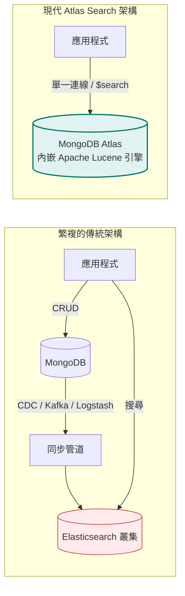

# 進階專題：MongoDB Atlas Search (全文檢索與向量搜尋)

在過去，若應用程式需要強大的搜尋功能（例如打字自動補全、錯字容忍、相關度權重排序），架構師往往必須在 MongoDB 旁邊額外架設一座 **Elasticsearch** 叢集，並透過 CDC 工具（如 Debezium、Kafka）同步資料。

**MongoDB Atlas Search** 徹底顛覆了這種複雜架構：它直接將業界標準的 **Apache Lucene 搜尋引擎**深植於 MongoDB 之中，無需維運額外叢集，也無資料同步延遲，且直接透過現有的聚合管道（`$search`）即可查詢！



---

## 1. 傳統 `$text` 索引 vs Atlas Search

| 特性比較 | 傳統 MongoDB `$text` 索引 | 現代 Atlas Search (`$search`) |
| :--- | :--- | :--- |
| **底層技術** | MongoDB 內建簡單反向索引 | **Apache Lucene 完整搜尋引擎** |
| **錯字容錯 (Fuzzy Search)** | ❌ 不支援 |  支援（設定 `fuzzy: { maxEdits: 2 }`） |
| **自動補齊 (Autocomplete)** | ❌ 困難且效能差 |  原生專用分詞器，體驗極佳 |
| **自定義分析器 (Analyzers)** | 基礎語言字典 |  支援自定義分詞、停用詞、同義字（Synonyms） |
| **向量檢索 (Vector Search)** | ❌ 不支援 |  **支援 AI 向量搜尋與 RAG 架構** |
| **計分調權 (Scoring / Boost)** | 陽春 |  支援強大的 BM25 演算法與動態評分權重 |

---

## 2. 建立 Search Index (搜尋索引)

在 MongoDB Atlas 控制台或 Compass 中，為集合（例如 `products`）建立搜尋索引。

### 基本動態索引 JSON 配置：
```json
{
  "mappings": {
    "dynamic": true,
    "fields": {
      "name": [
        {
          "type": "string",
          "analyzer": "lucene.standard"
        },
        {
          "type": "autocomplete",
          "analyzer": "lucene.standard"
        }
      ],
      "description": {
        "type": "string",
        "analyzer": "lucene.standard"
      }
    }
  }
}
```

---

## 3. `$search` 核心語法實戰

!!! important "`$search` 必須是聚合管道的第一步"
    `$search` 運算符只能放在 Aggregation Pipeline 的**第一個階段（First Stage）**！

### A. 容錯模糊搜尋 (Fuzzy Search)
使用者打錯字（例如將 `iphone` 打成 `iphnoe`）依然能精準命中：

```javascript
db.products.aggregate([
  {
    $search: {
      index: "default",
      text: {
        query: "iphnoe",
        path: "name",
        fuzzy: {
          maxEdits: 2,          // 允許編輯距離最大為 2 (允許漏字、多字或打錯字)
          prefixLength: 1       // 開頭第一個字母必須精確符合以提高效能
        }
      }
    }
  },
  {
    $project: {
      name: 1,
      price: 1,
      score: { $meta: "searchScore" } // 取得 Lucene 的 BM25 相關度評分
    }
  }
]);
```

### B. 搜尋框打字即時推薦 (Autocomplete)
使用者輸入 `無線`，立即推薦包含 `無線耳機`、`無線滑鼠`：

```javascript
db.products.aggregate([
  {
    $search: {
      index: "default",
      autocomplete: {
        query: "無線",
        path: "name",
        tokenOrder: "sequential"
      }
    }
  },
  { $limit: 5 },
  { $project: { name: 1 } }
]);
```

### C. 複合多條件組合 (Compound Operator)
類似 Elasticsearch 的 `bool` 查詢，支援邏輯評分加權：

```javascript
db.products.aggregate([
  {
    $search: {
      index: "default",
      compound: {
        must: [
          // 必須滿足：標題或描述包含「耳機」
          { text: { query: "耳機", path: ["name", "description"] } }
        ],
        should: [
          // 加分項目：若標籤包含「降噪」，大幅提高排名權重 (score boost)
          { text: { query: "降噪", path: "tags", score: { boost: { value: 3 } } } }
        ],
        filter: [
          // 純過濾：不計分，但類別必須是「電子產品」
          { phrase: { query: "電子產品", path: "category" } }
        ]
      }
    }
  },
  { $limit: 10 }
]);
```

---

## 4. 現代 AI 核心：Atlas Vector Search (向量語義檢索)

隨著生成式 AI (Generative AI) 與大型語言模型 (LLM) 的興起，**Atlas Vector Search** 讓 MongoDB 搖身一變成為標準的**向量資料庫 (Vector Database)**，原生支援 **RAG (檢索增強生成)**！

```mermaid
flowchart LR
    UserQuery[使用者輸入自然語言查詢<br/>'我想找適合雨天慢跑的防水耳機'] --> Embed[OpenAI Embedding 模型]
    Embed -->|轉換為 1536 維向量| Vector[向量陣列 [0.012, -0.043, ...]]
    Vector --> VSearch["$vectorSearch<br/>尋找最近鄰 (HNSW / Cosine)"]
    VSearch --> Context[(最相似之商品文件)]
    Context --> LLM[LLM 生成最終回應]

    style VSearch fill:#e8f5e9,stroke:#2e7d32;
    style Context fill:#ede7f6,stroke:#512da8;
```

### A. 建立向量搜尋索引 (Vector Index)
```json
{
  "fields": [
    {
      "type": "vector",
      "path": "embedding",
      "numDimensions": 1536,
      "similarity": "cosine"
    }
  ]
}
```

### B. `$vectorSearch` 聚合查詢
不再侷限於字面上的關鍵字匹配，而是理解語義：

```javascript
db.products.aggregate([
  {
    $vectorSearch: {
      index: "vector_index",
      path: "embedding",
      queryVector: [0.0123, -0.0456, 0.0891, ...], // 使用者問題產生的 Embedding 向量
      numCandidates: 100,                          // 候選探測節點數 (提升準確度)
      limit: 5                                     // 取最接近的前 5 筆
    }
  },
  {
    $project: {
      name: 1,
      description: 1,
      score: { $meta: "vectorSearchScore" }       // 餘弦相似度評分 (0 ~ 1)
    }
  }
]);
```

---

## 5. 多語言呼叫範例

=== "Python (PyMongo)"
    ```python
    pipeline = [
        {
            "$search": {
                "index": "default",
                "text": {
                    "query": "降噪藍牙",
                    "path": "name",
                    "fuzzy": {"maxEdits": 1}
                }
            }
        },
        {"$limit": 5}
    ]
    results = list(db.products.aggregate(pipeline))
    ```

=== ".NET (C#)"
    ```csharp
    var searchStage = new BsonDocument("$search", new BsonDocument
    {
        { "index", "default" },
        { "text", new BsonDocument
            {
                { "query", "降噪藍牙" },
                { "path", "name" },
                { "fuzzy", new BsonDocument("maxEdits", 1) }
            }
        }
    });

    var pipeline = new IPipelineStageDefinition[]
    {
        new SimplePipelineStageDefinition<Product, Product>(searchStage),
        PipelineStageDefinitionBuilder.Limit<Product>(5)
    };

    var results = await collection.Aggregate<Product>(pipeline).ToListAsync();
    ```

=== "Golang"
    ```go
    pipeline := mongo.Pipeline{
        {{"$search", bson.D{
            {"index", "default"},
            {"text", bson.D{
                {"query", "降噪藍牙"},
                {"path", "name"},
                {"fuzzy", bson.D{{"maxEdits", 1}}},
            }},
        }}},
        {{"$limit", 5}},
    }

    cursor, err := col.Aggregate(ctx, pipeline)
    ```
