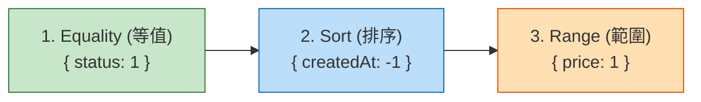

# Level 4：索引與效能調校 (Indexing & Performance)

當資料量從數千筆成長到數百萬筆時，沒有索引的資料庫將陷入災難性的慢速。本章節將揭密 MongoDB 的索引機制與業界效能調優金科玉律。

---

## 1. 索引底層與常見類型

MongoDB 的索引底層採用 **B-Tree** 結構。沒有索引時，MongoDB 必須執行 **全表掃描 (COLLSCAN)**；有了索引，即可透過 **索引掃描 (IXSCAN)** 在 $O(\log N)$ 時間複雜度內定位資料。

### A. 單欄位索引 (Single Field Index)
```javascript
// 為 email 建立唯一索引 (不允許重複)
db.users.createIndex({ email: 1 }, { unique: true });
```

### B. 複合索引 (Compound Index)
包含多個欄位的索引，欄位的「先後順序」具有絕對關鍵影響（符合最左前綴原則）。
```javascript
// 針對「狀態」與「建立日期」建立複合索引
db.orders.createIndex({ status: 1, createdAt: -1 });
```

### C. 多鍵索引 (Multikey Index)
當索引欄位包含「陣列」時，MongoDB 會自動建立多鍵索引，為陣列中的每一個元素都建立索引節點。
```javascript
// tags 是陣列: ["vue", "mongodb", "python"]
db.articles.createIndex({ tags: 1 });
```

### D. TTL 索引 (Time To Live 自動過期)
指定過期時間，MongoDB 後台線程會自動刪除超時文件（非常適合驗證碼、Session、暫存 Token）。
```javascript
// 建立 3600 秒 (1小時) 後自動刪除的日誌索引
db.user_sessions.createIndex(
  { createdAt: 1 },
  { expireAfterSeconds: 3600 }
);
```

---

## 2. 複合索引設計金科玉律：ESR 原則

當一個查詢同時具備「等值查詢」、「排序」與「範圍查詢」時，複合索引欄位的順序應遵循 **ESR 規則**：

$$\mathbf{E} \rightarrow \mathbf{S} \rightarrow \mathbf{R}$$

1. **E - Equality (等值查詢)**：放在最前頭（如 `status: "ACTIVE"`）
2. **S - Sort (排序欄位)**：緊接在等值之後（如 `sort({ createdAt: -1 })`）
3. **R - Range (範圍查詢)**：放在最後面（如 `price: { $gte: 100, $lte: 500 }`）



> **為什麼？**  
> 等值篩選能立即將資料大幅縮小到一個區塊；在此區塊內，利用索引本身的有序性直接滿足 `Sort`，避免在記憶體中進行昂貴的 `SORT` 操作；最後再於排序區間內對 `Range` 進行掃描。

---

## 3. 執行計畫分析：`explain("executionStats")`

調優查詢的第一步就是查看資料庫的實際執行報告：

```javascript
db.orders.find({
  status: "PAID",
  totalAmount: { $gte: 1000 }
})
.sort({ createdAt: -1 })
.explain("executionStats");
```

### 關鍵指標指標解讀：

| 指標欄位 | 理想狀態 | 危險警訊 | 意義 |
| :--- | :--- | :--- | :--- |
| `stage` | **IXSCAN**、**FETCH** | **COLLSCAN**、**SORT** | `COLLSCAN` 代表全表掃描；`SORT` 代表記憶體額外排序 |
| `nReturned` | 與 `totalDocsExamined` 接近 | `nReturned` 遠小於 `totalDocsExamined` | 實際回傳的筆數 |
| `totalDocsExamined` | 越小越好 | 數千甚至數萬筆 | 儲存引擎實際從硬碟讀出檢查的文件數 |
| `totalKeysExamined` | 越小越好 | 遠大於 `nReturned` | 索引樹中掃描過的鍵值數 |

!!! tip "黃金比率公式"
    **理想狀態**：`totalDocsExamined` 等於 `nReturned`（讀出的每一筆資料都是最終要的，完全無白工）。  
    若 `totalDocsExamined` 高達 10,000，但 `nReturned` 只有 5，代表索引設計不良或缺少索引！

---

## 4. 終極效能：覆蓋查詢 (Covered Query)

當查詢所需的全部欄位（包含查詢條件與投影欄位）**都已經存在於索引中**，MongoDB 甚至完全不需要去讀取實際的文件（Document），直接從記憶體中的索引樹返回結果！

- 執行計畫特徵：只有 `IXSCAN`，**完全沒有 `FETCH` 階段**。
- 達成要件：必須顯式在 projection 中排除 `_id`（除非 `_id` 也在索引中）：
  ```javascript
  // 建立索引
  db.users.createIndex({ username: 1, age: 1 });

  // 覆蓋查詢 (完全免除讀取硬碟文件)
  db.users.find(
    { username: "alice" },
    { username: 1, age: 1, _id: 0 }
  );
  ```
