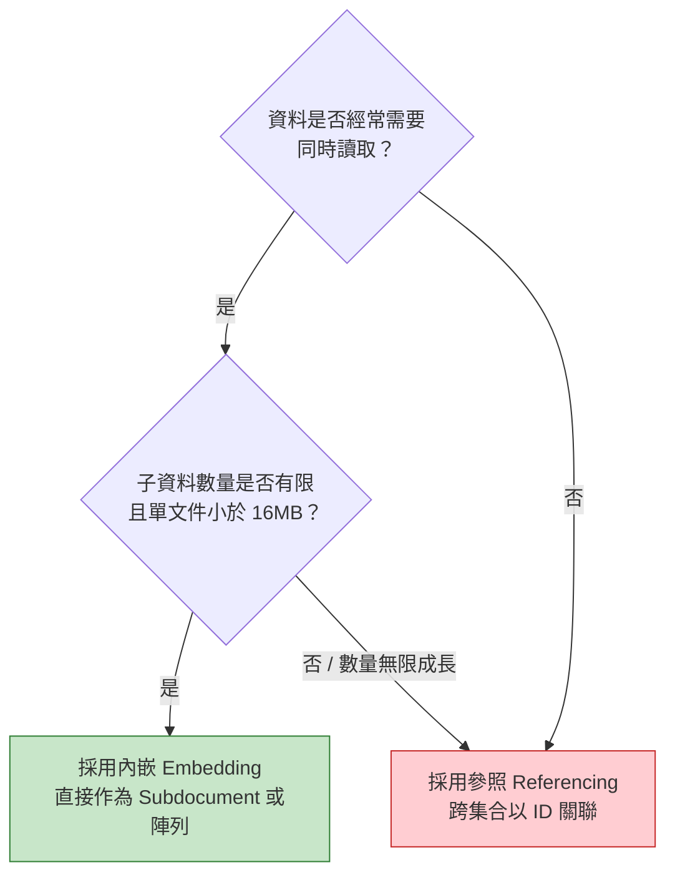

# Level 5：資料模型設計思維 (Data Modeling)

在關聯式資料庫中，設計模式通常是依循「第三正規化 (3NF)」來消除重複；然而在 MongoDB 中，**設計的核心原則是：為應用程式的「存取模式（Access Patterns）」量身打造**。

> **NoSQL 核心箴言**：資料如果是一起被讀取的，就應該儲存在一起（Data that is accessed together should be stored together）。

---

## 1. 內嵌 (Embedding) vs 參照 (Referencing)



### 決策矩陣對比

| 考量維度 | 內嵌 (Embedding) | 參照 (Referencing) |
| :--- | :--- | :--- |
| **讀取效能** | ⚡ 極快（單次 I/O 取得完整資料，無 JOIN 開銷） | 稍慢（需多次查詢或 `$lookup`） |
| **原子性保證** | 單一文件更新具備天然 ACID 原子性 | 需多文件 Transaction 才能保證一致性 |
| **資料大小限制** | 必須注意單一文件 **16MB 上限** | 無限制，資料分散在不同集合中 |
| **適用場景** | 「包含」關係、1:Few、生命週期高度相依（如訂單明細） | 獨立實體、多對多關係、資料頻繁單獨修改 |

---

## 2. 關係模型實務設計指南

### A. 一對很少 (One-to-Few) ➔ 內嵌
- **範例**：使用者的多個收件地址（通常只有 1~5 個）。
- **作法**：直接在 `users` 文件內嵌入 `addresses: [{ street, city, zip }]`。

### B. 一對多 (One-to-Many) ➔ 內嵌或參照
- **範例**：電商商品的規格或配件（通常數十個）。
- **作法**：可內嵌在商品內；若規格常被獨立維護或數量龐大，則使用獨立 Collection。

### C. 一對超級多 (One-to-Squillions) ➔ 子文件反向參照
- **範例**：日誌日誌（Log）、伺服器感測器數據、Twitter 推文回覆。
- **作法**：**千萬不要在母文件放入無窮增長的陣列**！應在每筆 Log 文件中記錄母實體 ID：
  ```javascript
  // logs 集合中
  {
    _id: ObjectId(...),
    serverHost: "app-node-01",
    message: "CPU 負載過高",
    timestamp: ISODate("2026-09-05T10:00:00Z")
  }
  ```

---

## 3. 業界四大必備設計模式

### 模式 1：Subset Pattern（子集模式）
- **痛點**：一篇熱門文章有數萬則留言，若一次載入會拖垮首頁效能。
- **解法**：在文章主文件中只保留「前 5 則最新留言」內嵌（滿足 90% 使用者首頁需求）；完整留言存於獨立的 `comments` 集合，點擊「查看全部」時再分頁讀取。

### 模式 2：Extended Reference Pattern（擴展參照模式）
- **痛點**：訂單只要顯示買家的「姓名」與「電話」，卻為了這個每次都要 `$lookup` 使用者表。
- **解法**：在訂單中保留關聯 ID 同時，冗餘複製最常用的唯讀欄位：
  ```javascript
  // orders 集合
  {
    orderId: "ORD2026090501",
    totalPrice: 1500,
    customer: {
      userId: ObjectId("64f..."),
      name: "王小明",          // 常用欄位直接內嵌
      phone: "0912-345-678"     // 省去關聯開銷
    }
  }
  ```

### 模式 3：Attribute Pattern（屬性模式）
- **痛點**：商品有成千上萬種規格（手機有螢幕尺寸、衣物有顏色尺碼、硬碟有容量轉速），若直接當欄位，索引會爆炸。
- **解法**：將特徵規格轉換為鍵值陣列：
  ```javascript
  {
    productName: "經典T-shirt",
    specs: [
      { k: "color", v: "black" },
      { k: "size", v: "L" },
      { k: "material", v: "cotton" }
    ]
  }
  // 只需對 specs.k 與 specs.v 建立一個複合索引，就能支援所有屬性的篩選！
  db.products.createIndex({ "specs.k": 1, "specs.v": 1 });
  ```

### 模式 4：Bucket Pattern（桶模式）
- **痛點**：IoT 感測器每秒傳送一筆溫度，若一秒存一筆文件，儲存與索引開銷過於龐大。
- **解法**：以小時或天為單位，把多筆讀數打包在同一筆文件的陣列中：
  ```javascript
  {
    sensorId: "temp-sensor-12",
    date: "2026-09-05",
    hour: 14,
    readings: [25.4, 25.5, 25.8, ...], // 60 筆數據塞在同一個桶
    count: 60,
    sum: 1530.2
  }
  ```

---

## 4. Schema 驗證（JSON Schema Validation）

雖然 MongoDB 是無結構限制（Schema-less），但在生產環境通常會加上 **Schema Validation** 防止髒資料寫入：

```javascript
db.createCollection("users", {
  validator: {
    $jsonSchema: {
      bsonType: "object",
      required: ["username", "email", "age"],
      properties: {
        username: {
          bsonType: "string",
          description: "username 必須為字串且必填"
        },
        email: {
          bsonType: "string",
          pattern: "^.+@.+$",
          description: "email 必須符合基本郵件格式"
        },
        age: {
          bsonType: "int",
          minimum: 0,
          maximum: 150,
          description: "age 必須介於 0 至 150 歲的整數"
        }
      }
    }
  }
});
```
