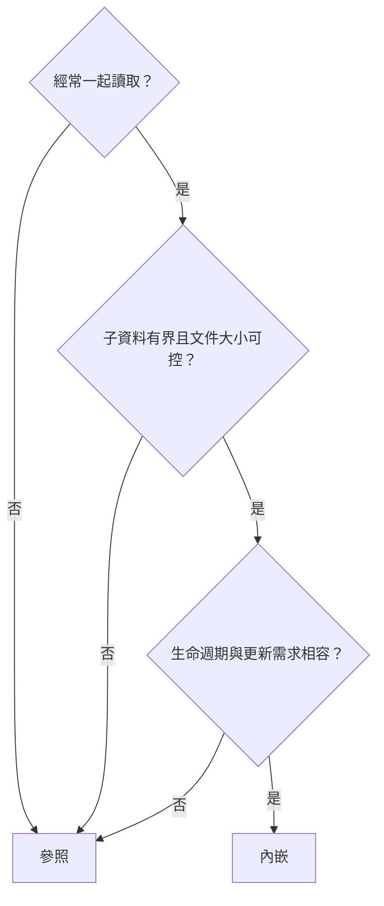

# 資料模型設計思維

**前置條件：** 完成 CRUD 與聚合章節。本章先用存取需求做設計取捨，再於獨立集合練習 schema validation；文件結構標示為「示意」時不是可直接貼上的命令。

## 1. 先列出存取模式

針對每個畫面或工作列出：讀哪些欄位、資料量、排序、更新頻率、是否必須一起原子變更。以訂單為例，明細通常一起讀取且需要保留成交價格，適合內嵌；商品本身仍為獨立實體。



| 考量 | 內嵌 | 參照 |
| --- | --- | --- |
| 讀取 | 一次取得所需資料，文件可能變大 | 額外查詢或 lookup，需設計索引 |
| 原子更新 | 單文件操作原子 | 若跨文件必須一起成功才需要交易 |
| 成長 | 不能放無界陣列 | 子文件可分散，但每筆仍有 16 MiB 上限 |
| 資料生命週期 | 經常一起新增／刪除 | 可各自維護與重用 |

單文件原子性不等於所有讀寫自然滿足業務一致性；仍需正確 filter 與 read/write concern。參照也不一定需要每次都用交易，取決於不變條件。

## 2. 關係與四大設計模式

One-to-few 如少量地址可內嵌；數量不確定的評論、日誌應以子文件參照父 ID，並用索引分頁查詢。不要在父文件累積所有子 ID。

### Subset：只內嵌常用子集

文章保留最新五則留言供列表顯示，完整留言在 comments。必須定義新增、刪除留言時如何更新子集；可接受延遲的快取與需要強一致的資料不能混為一談。

### Extended Reference：快照或副本要說清楚

訂單內嵌買家顯示名稱、地址與成交價格，可減少讀取時的 lookup。關鍵是分辨：

- **歷史快照：** 下單時的地址、單價通常不跟著使用者或商品修改。
- **目前資料副本：** 若顯示「目前姓名」，就需更新策略，例如事件同步或讀取時取得最新資料，並定義可接受延遲。

本課程 orders.items.unitPrice 是歷史快照，所以統計營收不使用 products.price。

### Attribute：用鍵值陣列處理可變規格

以下是獨立集合中的可執行練習，不會改掉共用商品的 specs 型別：

```javascript
db.attribute_lab.replaceOne(
  {_id: "shirt"},
  {_id: "shirt", specs: [{k: "color", v: "black"}, {k: "size", v: "L"}]},
  {upsert: true}
)
db.attribute_lab.createIndex({"specs.k": 1, "specs.v": 1})
db.attribute_lab.find({specs: {$elemMatch: {k: "color", v: "black"}}})
// 命中 shirt
```

使用 elemMatch 才能要求同一元素的 k/v 配對。這能減少為不同規格建立大量欄位索引，但不是所有查詢都會自然變快，仍要用 explain 檢查。

### Bucket：把有界的多筆讀數合併

**示意文件：**

```javascript
({
  sensorId: "temp-12",
  bucketStart: ISODate("2026-01-01T00:00:00Z"),
  readings: [{at: ISODate("2026-01-01T00:00:00Z"), value: 25.4}],
  count: 1,
  sum: 25.4
})
```

以時間與容量雙重限制 bucket，達到上限就開新桶；更新 readings/count/sum 應同一文件一起更新。若為時序資料，也應評估 MongoDB time-series collection 的內建管理，而非一律手刻桶。

## 3. 型別與 schema validation

本課程統一 ObjectId 關聯、UTC createdAt 與整數分。Python int、Go int64、C# long 可能以不同整數 BSON 型別寫入，因此驗證器可接受 int 與 long；不能用 double 金額偷偷繞過契約。

下列程式可重跑，設定只作用於專用 validated_products 集合：

```javascript
const validationOptions = {
  validator: {$jsonSchema: {
    bsonType: "object",
    required: ["name", "price", "stock"],
    properties: {
      name: {bsonType: "string"},
      price: {bsonType: ["int", "long"], minimum: 0},
      stock: {bsonType: ["int", "long"], minimum: 0}
    }
  }},
  validationLevel: "strict",
  validationAction: "error"
};
if (db.getCollectionNames().includes("validated_products")) {
  db.runCommand({collMod: "validated_products", ...validationOptions});
} else {
  db.createCollection("validated_products", validationOptions);
}
db.validated_products.replaceOne(
  {_id: "valid"}, {_id: "valid", name: "練習商品", price: NumberLong("100"), stock: 1},
  {upsert: true}
)
// 預期成功
db.validated_products.insertOne({name: "錯誤商品", price: "100", stock: -1})
// 預期 Document failed validation；這是刻意的失敗案例
```

既有集合加上驗證不會自動修復所有舊資料。正式遷移應先盤點不合規文件、修正或分階段導入，再收緊驗證。

## 練習與解答

**練習：** 商品改價後，既有訂單的總營收應跟著改嗎？

??? success "解答"
    不應。訂單 unitPrice 表示成交快照；計算營收使用 qty × unitPrice。若直接 lookup 當前商品 price，歷史報表會隨改價變動。

參考：[Schema validation](https://www.mongodb.com/docs/manual/core/schema-validation/)、[Data modeling](https://www.mongodb.com/docs/manual/data-modeling/)。
