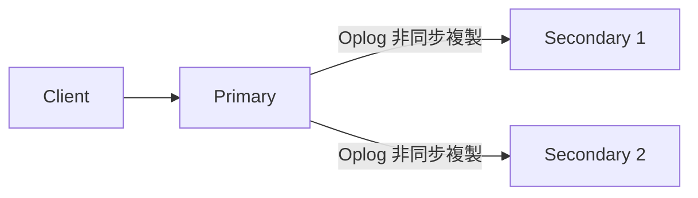
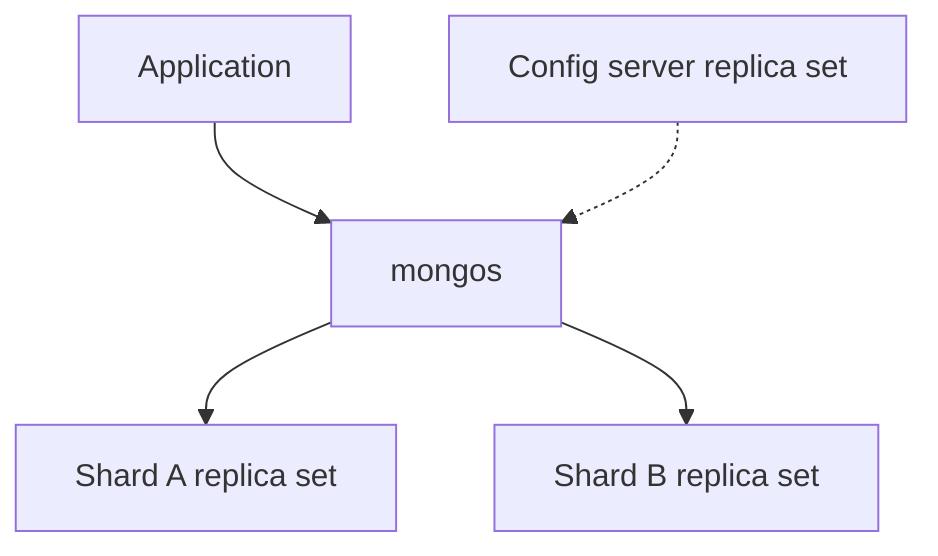

# 叢集架構、高可用與維運

**前置條件：** 完成[交易用環境](lab.md)。本章區分可在本機做的驗證與架構概念；單節點環境不能證明容錯或水平擴展能力。

## 1. 副本集與故障轉移



Primary 處理寫入；secondaries 複製資料並參與符合資格的選舉。預設 electionTimeoutMillis 為 10 秒，但故障偵測、選舉、網路及客戶端重試都會影響實際中斷時間。最新 oplog 不是唯一選舉條件，還涉及資格、priority 與多數票。

本機 `rs0` 只有一個成員，停止它就是完全無服務。要演練高可用，需至少建立適當的多節點拓撲，並測量切換期間讀寫的結果；本課程不自動建立或停止這類叢集。

複製不能取代備份：誤刪也會複製到其他成員。

## 2. Read preference、read concern 與 write concern

| 設定 | 控制什麼 | 不代表什麼 |
| --- | --- | --- |
| readPreference=primary | 從 primary 讀取 | 單憑節點偏好不保證線性一致性 |
| secondaryPreferred | 優先 secondary，必要時 primary | secondary 可能落後，不保證最新 |
| w=1 | 要求 primary 確認 | 不代表已複製到多數節點 |
| w=majority | 多數確認，耐久性還受 journaling 等配置影響 | 不能承諾所有災難下零資料遺失 |
| readConcern=majority | 讀取多數提交的資料 | 不等於所有讀取都取得最新值 |
| readConcern=snapshot | 一致快照，用於本課程交易 | 不等於跨請求永久固定的快照 |

多數 MongoDB 部署的預設 write concern 是 majority，但拓撲有例外，應檢查實際配置，不把 w=1 當成通用預設。需要單文件線性一致性時，需依官方限制搭配 linearizable read concern、majority writes 與 primary 等條件；不能只設定 primary。[Write Concern](https://www.mongodb.com/docs/manual/reference/write-concern/)、[Read Concern](https://www.mongodb.com/docs/manual/reference/read-concern/)

可在交易環境檢查：

```powershell
docker compose -f compose.transactions.yml exec -T mongodb mongosh --quiet --eval 'db.adminCommand({getDefaultRWConcern: 1})'
```

transaction callback 的 retry 不等於任意 API 重送的業務冪等性。重送付款請求仍需獨立的唯一業務鍵及結果記錄。

## 3. Sharding 的取捨



mongos 根據分片 metadata 路由請求；每個 shard 保存部分資料。分片是因應容量與負載，不是資料量到某個固定門檻就必須使用。

分片鍵應同時考量 cardinality、值頻率、寫入分布與常用查詢。範圍分片的單調遞增鍵可能形成寫入熱點；hashed 能分散寫入，但可能讓範圍查詢散到多個 shard。複合鍵也不能只加個 ID 就保證有效，必須用工作負載驗證路由與分布。

## 4. 本機備份與還原演練

本例使用 MongoDB 容器內的 Database Tools，不要求 Windows 額外安裝 mongodump。先停止應用程式寫入教學資料庫，避免跨集合備份不一致；正式在線備份需另外規劃一致性策略、復原時間及復原點。

```powershell
docker compose exec -T mongodb mongodump --username admin --password password123 --authenticationDatabase admin --db mongo_learning_lab --archive=/tmp/mongo-learning-lab.archive
docker compose cp mongodb:/tmp/mongo-learning-lab.archive ./mongo-learning-lab.archive
```

第二步把備份帶出容器。archive 可能包含資料，不應提交版本庫；正式備份還需異地保存與存取控管。

還原到獨立的 `mongo_learning_restore_check`，保留原資料。**該目標必須尚未存在**；如存在請先檢查先前演練結果，勿直接覆蓋或加入 --drop。

```powershell
docker compose exec -T mongodb mongosh -u admin -p password123 --authenticationDatabase admin --quiet /examples/restore-preflight.js
# 上一行成功才繼續；PowerShell 不會自動在外部命令失敗時停止。
if ($LASTEXITCODE -ne 0) { throw "Restore target already exists" }
docker compose exec -T mongodb mongorestore --username admin --password password123 --authenticationDatabase admin --archive=/tmp/mongo-learning-lab.archive --nsFrom='mongo_learning_lab.*' --nsTo='mongo_learning_restore_check.*'
if ($LASTEXITCODE -ne 0) { throw "Restore failed" }
docker compose exec -T mongodb mongosh -u admin -p password123 --authenticationDatabase admin --quiet /examples/restore-check.js
```

檢查腳本比較每個集合的文件與索引定義，預期顯示 Restore checks passed。只看到 mongodump 成功不足以證明備份可用。archive 與還原資料庫保留供人工檢查；若需重跑，請明確處理這個專用目標，勿刪原資料庫。

## 5. 最小權限

下列為帳號建立示意，請將密碼替換為自行管理的密碼後再執行；不會由初始化腳本自動建立：

```javascript
use mongo_learning_lab
db.createUser({
  user: "order_service",
  pwd: passwordPrompt(),
  roles: [{role: "readWrite", db: "mongo_learning_lab"}]
})
```

此帳號連線時 authSource 應為 mongo_learning_lab；admin root 僅供本機管理。維運還應觀察 replication lag、慢查詢、連線數與磁碟空間，先建立基線再設定告警。

## 練習與解答

**練習：** 三節點都有資料，為何還要定期做還原演練？

??? success "解答"
    複製會同步錯誤刪除與錯誤更新；備份才能提供歷史復原點。還原演練則確認工具、權限、檔案及操作程序可用，並量測實際復原時間。
