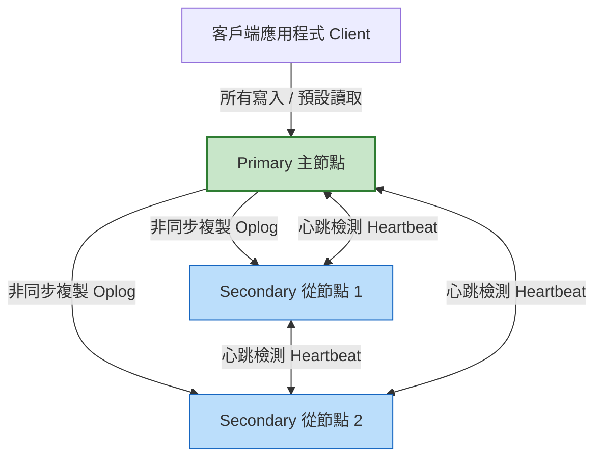
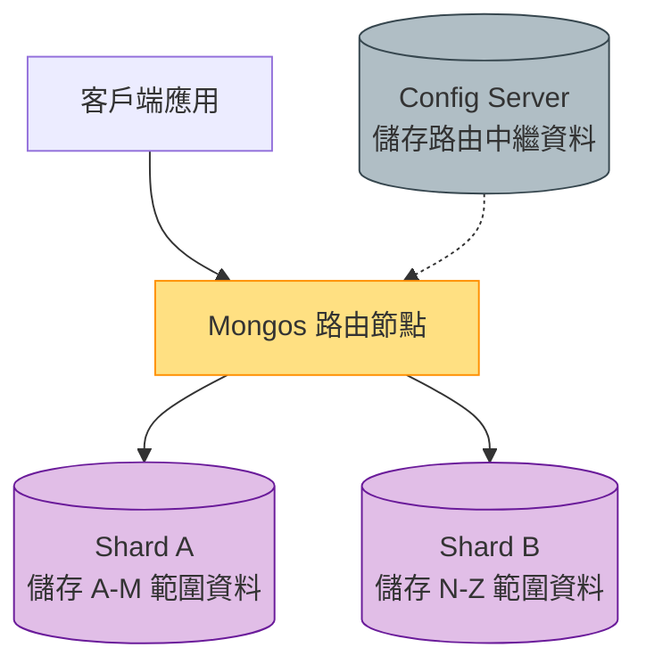

# Level 7：叢集架構與高可用維運 (Architecture & Operations)

當系統邁入生產環境（Production），面對百萬並發與海量資料時，單機架構已無法滿足需求。本章以架構師視角帶您剖析 MongoDB 的高可用（HA）與水平擴展（Scale-Out）實踐。

---

## 1. 副本集架構 (Replica Set)：高可用與容錯

副本集是由一組維護相同資料集的 `mongod` 程序組成，提供**冗餘備份**與**高可用性**。



### A. 自動故障轉移 (Automatic Failover)
- 當主節點（Primary）失聯超過 10 秒，剩餘的從節點（Secondary）會發起投票選舉。
- 擁有最新 Oplog 資料的 Secondary 會被選為新的 Primary，過程通常在數秒內完成，客戶端無須人工介入。

### B. 讀寫策略調配 (Read Preference & Write Concern)

- **Write Concern (寫入確認級別)**：
  - `w: 1`：只要 Primary 寫入記憶體/磁碟即回傳成功（預設）。
  - `w: "majority"`：必須多數節點（例如 3 台中的 2 台）都寫入確認才算成功，**保證資料不遺失**。
- **Read Preference (讀取節點偏好)**：
  - `primary`：所有讀取只找主節點（保證讀到最新強一致性）。
  - `secondaryPreferred`：優先讀取從節點（適用於產生報表或讀大於寫的負載分流）。

---

## 2. 分片集群架構 (Sharding)：水平擴展

當資料量達到數十 TB 或寫入量超過單機負荷時，分片（Sharding）能將資料分佈在多台獨立機器上。



### 三大核心組件：
1. **`mongos` (查詢路由器)**：對客戶端呈現單一資料庫介面，解析客戶端請求並路由到對應的分片。
2. **`Config Server` (設定伺服器)**：通常是以 3 節點組成的副本集，儲存叢集元數據（各 Chunk 在哪個分片）。
3. **`Shard` (資料分片)**：實際儲存資料的分區，**每個分片本身都是一個副本集**！

### 分片鍵 (Shard Key) 挑選生死線：
- **避免單調遞增鍵 (Monotonic Key)**：例如純時間戳記或自增 ID，這會導致所有寫入永遠集中在最後一個分片（產生「寫入熱點 Write Hotspot」）。
- **推薦做法**：
  - **散列分片 (Hashed Sharding)**：使用 `_id: "hashed"` 均勻打散寫入壓力。
  - **複合分片鍵**：結合範圍查詢欄位與唯一識別碼。

---

## 3. 備份、還原與維運日常

### A. 邏輯備份與還原 (`mongodump` & `mongorestore`)

```bash
# 備份指定資料庫至 dump 目錄
mongodump --host localhost:27017 -u admin -p password123 --authenticationDatabase admin --db store_db --out /backup/20260905/

# 將備份還原回資料庫
mongorestore --host localhost:27017 -u admin -p password123 --authenticationDatabase admin --db store_db /backup/20260905/store_db/
```

### B. 角色型存取控制 (RBAC) 最佳實踐
不要永遠使用 `root` 帳號！為微服務建立最小權限原則的使用者：

```javascript
use store_db;
db.createUser({
  user: "order_service",
  pwd: "SecurePassword999!",
  roles: [
    { role: "readWrite", db: "store_db" }
  ]
});
```
