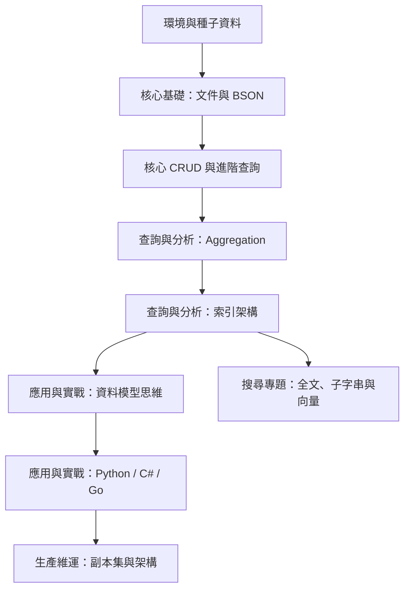

# MongoDB 實戰升級指南

這套教學面向具備基本程式設計能力的開發者。從共同的電商資料出發，練習查詢、索引、模型與交易，再認識搜尋與維運。每章提供前置條件、結果與練習解答。

先完成[實作環境與共用資料](lab.md)，再依以下順序閱讀。Python、C#、Go 可擇一學習；它們使用相同 BSON 欄位與金額約定。



| 模組篇章 | 完成後可以做什麼 |
| --- | --- |
| [核心觀念與環境架設](01-basics.md) | 連線並辨識 ObjectId／Date 等 BSON 型別 |
| [核心 CRUD 與進階查詢](02-crud.md) | 條件更新庫存、穩定分頁、區分 null 與欄位不存在 |
| [聚合管道 Aggregation](03-aggregation.md) | 產出有固定預期結果的月度營收排行榜 |
| [索引架構與效能調校](04-indexing.md) | 比較索引前後的掃描量，解讀 covered query |
| [全文、子字串與向量搜尋](04-atlas-search.md) | 配對索引與查詢，分辨字面搜尋與向量相似度 |
| [資料模型設計思維](05-data-modeling.md) | 選擇內嵌／參照，使用四大模式與驗證器 |
| [Python 實戰整合](06-python-integration.md) | PyMongo 同步與 Async、Pydantic、交易 |
| [.NET C# 實戰整合](06-dotnet-integration.md) | BSON 映射、LINQ、Builders 與交易 |
| [Go 實戰整合](06-golang-integration.md) | Driver v2、context、BSON 與交易 |
| [叢集架構與高可用](07-architecture.md) | 區分一致性設定，完成備份還原驗證 |
| [高頻語法與指令速查表](cheatsheet.md) | 隨時查閱常用 CRUD、聚合運算子、索引維護與 mongosh 技巧 |
| [經典錯誤排查與 FAQ](troubleshooting.md) | 迅速診斷連線超時、記憶體溢出、游標過期與副本集衝突 |


一般 Compose 可執行 CRUD 與索引；交易用另一份單節點 replica set。Search 需相容的額外部署，手工向量練習不呼叫付費 API。

## 本機閱讀

```powershell
uv run mkdocs serve
```

開啟 <http://127.0.0.1:8000>。驗證文件建置使用 `uv run mkdocs build --strict`。網站程式碼區塊直接引用 examples 中的可執行檔，降低文件與實作不同步的風險。
