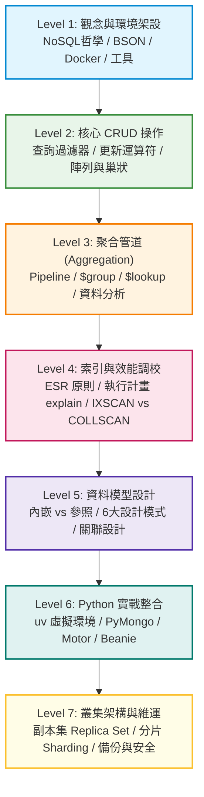

# 🍃 MongoDB 實戰升級指南

歡迎來到 **MongoDB 由淺入深實戰指南**！本文件專門為想要系統化掌握 MongoDB 的開發者設計，從底層的核心概念、基礎 CRUD 操作，進階到聚合管道（Aggregation）、索引優化與資料模型設計（Data Modeling），最後結合現代 Python 生態系與生產環境高可用架構。

---

## 🗺️ 學習路徑全景地圖



---

## 📚 各階段目標與章節導覽

| 階段 | 章節名稱 | 核心學習重點 | 建議耗時 |
| :--- | :--- | :--- | :--- |
| **Level 1** | [觀念與環境架設](01-basics.md) | NoSQL vs RDBMS、BSON 格式原理、Docker 環境建置、Compass/mongosh 工具 | 1~2 天 |
| **Level 2** | [核心 CRUD 操作](02-crud.md) | 豐富查詢過濾器（`$gt`, `$in`, `$elemMatch`）、原子更新運算符、陣列更新 | 2~3 天 |
| **Level 3** | [聚合管道 Aggregation](03-aggregation.md) | Pipeline 概念、`$match`, `$group`, `$unwind`, `$lookup` 關聯、報表分析 | 3~4 天 |
| **Level 4** | [索引與效能調校](04-indexing.md) | 複合索引、ESR 設計準則、`explain("executionStats")` 執行計畫解讀 | 2~3 天 |
| **Level 5** | [資料模型設計](05-data-modeling.md) | 內嵌（Embedding）vs 參照（Referencing）權衡、電商與社群常見設計模式 | 3~4 天 |
| **Level 6** | [Python 實戰整合](06-python-integration.md) | 使用 `uv` 與 `.venv`、PyMongo、Motor（非同步）、Pydantic 驗證、ACID 交易 | 3~4 天 |
| **Level 7** | [叢集架構與維運](07-architecture.md) | 副本集（Replica Set）高可用自動容錯、分片（Sharding）水平擴展、備份還原 | 2~3 天 |

---

## ⚡ 本地網站即時預覽

本教學文件站已整合 `mkdocs-material`，您隨時可以在終端機執行：

```powershell
uv run mkdocs serve
```

開啟瀏覽器前往 `http://127.0.0.1:8000` 即可享有具備快速搜尋、程式碼一鍵複製、深色模式切換的最佳閱讀體驗！
